# Projects

The ThinkAI Hackathon centers on employing Generative AI to address issues pertinent to Moroccan culture, its people, and the nation as a whole. Participants are expected to select a problem that aligns with the overarching theme of the hackathon. They can choose from a predefined list of real-world problems, each accompanied by a description, relevant resources, and suggested contributions. If participants have an innovative problem in mind that doesn't fit the predefined categories, they can propose an 'other' path. Teams must focus on solving only one problem and are encouraged to consult with mentors for any necessary adjustments. The selection of the problem does not influence the project’s evaluation criteria, which are detailed on a separate evaluation page.

Below, you'll find the projects submitted by all the participants of the hackathon. Each listing includes a brief description of the project, its objectives, and a link to the GitHub repository where you can explore the code, methodologies, and resources used. Feel free to delve into these projects to understand how each team approached their chosen problem using Generative AI, and perhaps even contribute to their further development or get inspired for your own future projects.

### [1st Place] Tensor Titans
Members: Abdellah WALID, Abdessamie Nachi, Tarik SGHIOURI IDRISSI \
GitHub Repo: [Tensor Titans Repo](https://github.com/Tensor-Titans/Lmaghrib-BinYedik/) \
Idea: A chatbot platform offering detailed information, navigation, pricing, and real-time support for tourists exploring Moroccan monuments.

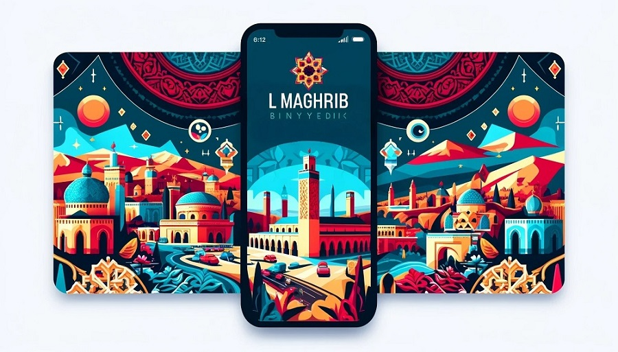 

https://github.com/YassineAII/ThinkAI2024/assets/83742992/900095ec-ac76-4c8c-a512-c424d9790956

### [2nd Place] Arthur Samuel
Members: Lamiaa EL OUATILI, Meryem JELFA, Yassine Bentaleb \
GitHub Repo: [Arthur Samuel Repo](https://github.com/arthur-samuel-thinkai/dayem/blob/main/README.md) \
Idea: Improving the efficiency of Moroccan agricultural practices using AI-based predictive analytics to optimize irrigation and crop management.

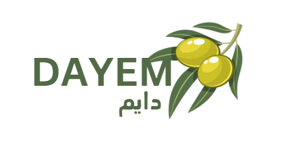

https://github.com/YassineAII/ThinkAI2024/assets/83742992/fbe1e8e9-634f-4131-b1f6-9375851cab55

### [3rd Place] The Eagles
Members: Abdeljalil EL Majjodi, Younes Benlaanaya, Ayoub Benali \
GitHub Repo: [The Eagles Repo](https://github.com/Dembelinho/Terjman_AI) \
Idea: Enhancing user interaction with LLMs by focusing on user requirements and providing useful tips and tricks. \

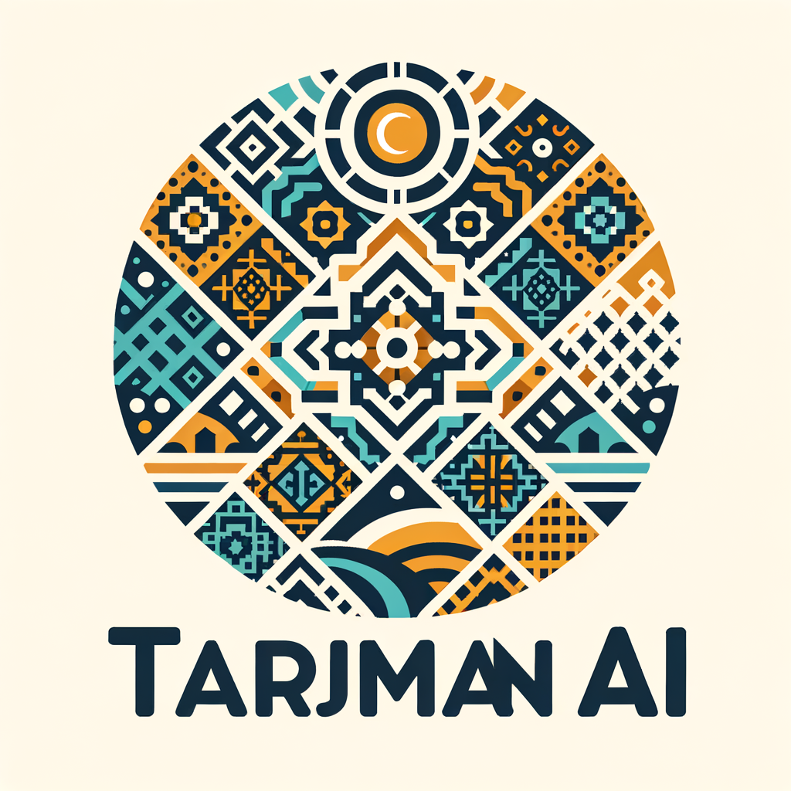 \
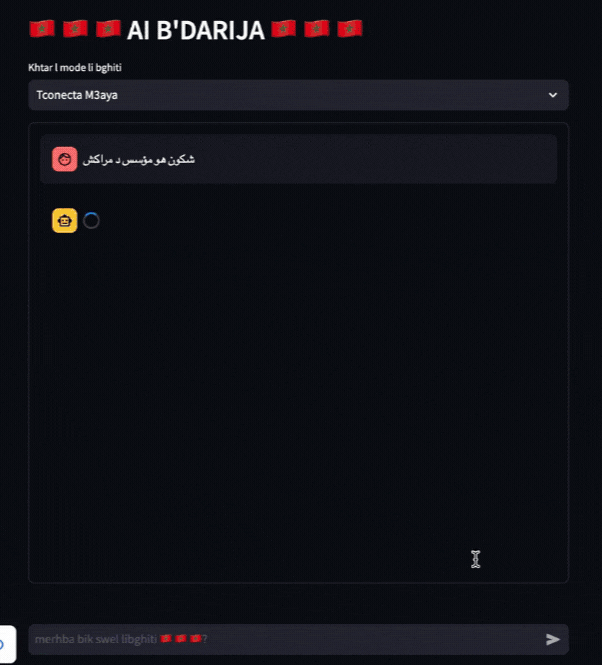 \
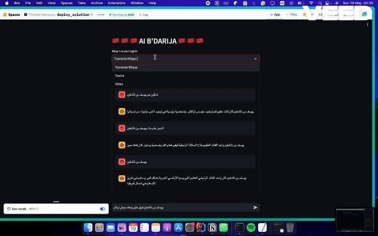 \

### [4th Place] SynthSis
Members: Abir HARRASSE, Yassmine ED-DYB \
GitHub Repo: [SynthSis Repo](https://github.com/Yassmine2020/SythSis) \
Idea: Connecting Moroccan entrepreneurs with mentors and investors to foster growth and innovation.

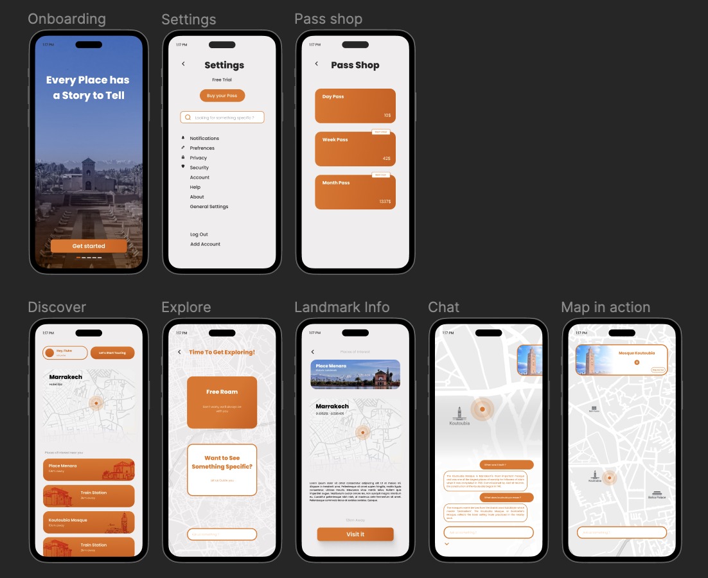

https://github.com/YassineAII/ThinkAI2024/assets/83742992/bb1cfb17-f52f-4fb0-822f-96a0adccdb84

### [5th Place] 3 bytes
Members: Mehdi Benabdelkader, Salah-Eddine Zaame, Aya Benchekroun \
GitHub Repo: [3 bytes Repo](https://github.com/AyaBenkabbour/Morchid) \
Idea: Providing tourists in Morocco with comprehensive guides, cultural insights, and real-time assistance.

### [6th Place] ThinkAnotI
Members: Mouad BERQIA, Ahmad Amine ZROULI, Zineb EL HOUZ \
GitHub Repo: [ThinkAnotI Repo](https://github.com/zrouliaa/ThinkAInterviewer) \
Idea: Enhancing energy management in Moroccan households using smart grid technology powered by renewable energy.

### [7th Place] TechSpark
Members: Mohammed EL BARHICHI, Imane MEZIANY, Asmae EL KHALFI \
GitHub Repo: [TechSpark Repo](https://github.com/MohamedAlaouiMhamdi/Flahti) \
Idea: Developing tools for small businesses to analyze market trends and make informed decisions.

https://github.com/YassineAII/ThinkAI2024/assets/83742992/011c46ac-2442-408c-bd1a-1eb09ffb6eb2

### [8th Place] IndusTrial and Error
Members: Mohamed BACHAR, Fatima Zahra OUBELLA, Omar MAROUANE \
GitHub Repo: [IndusTrial and Error Repo](https://github.com/moebachar/watiqaty) \
Idea: Educating industries on preventive measures and efficient management through a comprehensive platform.

### [9th Place] KYA
Members: Ali Elfilali, Yassine Chagna, Kawter Idhammou \
GitHub Repo: [KYA Repo](https://github.com/alielfilali01/ThinkAI24-Hack-KYA_Team) \
Idea: Enhancing tourists' and guests' comfort using AR and VR technology to educate them about Moroccan culture and history.

https://github.com/YassineAII/ThinkAI2024/assets/83742992/973b24cd-a76c-4a5e-9d65-920d56326226

### [10th Place] Deep Dive
Members: Mohammed Barrouch, Najwa NAAMANE, Maha LAABABI \
GitHub Repo: [Deep Dive Repo](https://github.com/SpixerD/Amazighini) \
Idea: Preserving Amazigh and Moroccan heritage by creating a digital library with translation and interpretation tools.

https://github.com/YassineAII/ThinkAI2024/assets/83742992/1474d703-74d9-4d28-900a-426e1ede8b8f

### MR.ROBOT
Members: ADRANE Akram, AMZYL Mohammed Ali, BELMOUSSA Abdallah \
GitHub Repo: [MR.ROBOT Repo](https://github.com/AkramOM606/e-SoccerCoach) \
Idea: Enhancing coaching decisions with an AI-driven tool that processes and highlights critical insights from live data during matches.

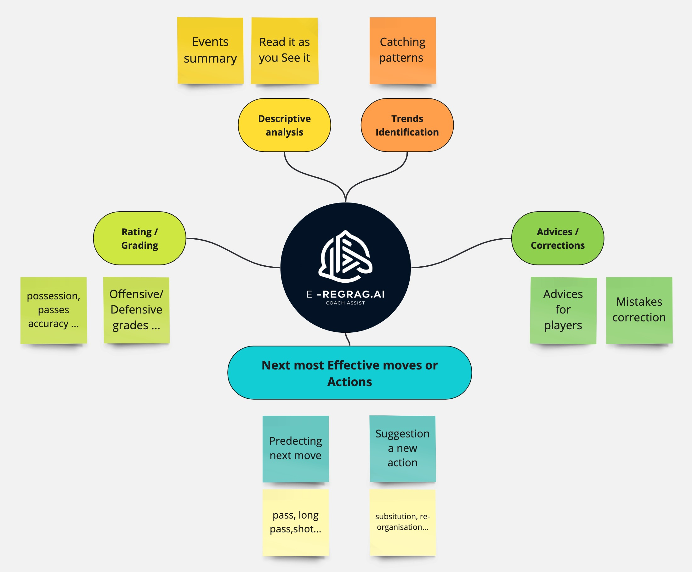

https://github.com/YassineAII/ThinkAI2024/assets/83742992/380e341b-09a8-40f0-b765-9d48cb032665

### Pixel Vision
Members: HAMZA BOUKTITIYA, HAMZA OKHADIR, CHERDID AOUATIF \
GitHub Repo: [Pixel Vision Repo](https://github.com/THINKAI-MOROCCO/Pixel-Vision) \
Idea: Providing an online and offline accessible medical sourcebook for first aid in the event of an accident at home.

### Fatal ERROR
Members: Harcha Badr-Eddine, Aissa Lamin, Merouane Zouaid \
GitHub Repo: [Fatal ERROR Repo](https://github.com/merouanezouaid/artigen-ai) \
Idea: Creating an online marketplace that helps Moroccan artisans showcase and sell their products while providing tools for business management.

https://github.com/YassineAII/ThinkAI2024/assets/83742992/2c58572e-67dd-4f73-9cff-c23fcbecd90b

### Breathe AI
Members: BEN JAAFAR Chaima, M'RHAR Kaoutar \
GitHub Repo: [Breathe AI Repo](https://github.com/Shaima-BenJaafar/Breathe-AI) \
Idea: Developing a discreet, AI-powered chatbot to connect women experiencing violence in Morocco with local support and resources.

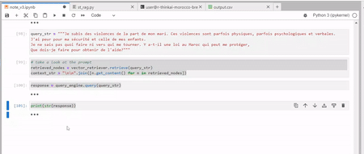

### 3odna
Members: FIRDAWSI Amine, AABIBI Youness, YASSIF Yassine \
GitHub Repo: [3odna Repo](https://github.com/yyassif/lguide-ai) \
Idea: Addressing critical solutions for security and risk management issues in various sectors.

https://github.com/YassineAII/ThinkAI2024/assets/83742992/707ec215-13aa-4b9a-af39-ad037b2846af

### Ai Wizards
Members: Ayoub Boulmeghras, Anas Aberchih, Moussa Aoukacha \
GitHub Repo: [Ai Wizards Repo](https://github.com/MohamedAlaouiMhamdi/Flahti/tree/main) \
Idea: Flahti is an AI-powered chatbot designed to assist users with legal advice, guiding them through common legal procedures and answering questions.

https://github.com/YassineAII/ThinkAI2024/assets/83742992/98df9ad2-c19d-4817-a796-0f7c0002c853

### ai-t math-n
Members: Mohamed Ouaicha, Yassir Salmi \
GitHub Repo: [ai-t math-n Repo](https://github.com/bssayla/Lfahem) \
Idea: Providing assistance in the field of law through an AI solution that helps people understand and manage their legal needs.

### AI Gravity
Members: Oumayma Bennouna, Oumaima Bendidi, Youssef Abedali \
GitHub Repo: [AI Gravity Repo](https://github.com/juicysuii/Henini-Afcon/blob/main/README.md) \
Idea: Offering real-time navigation, language translation, and cultural tips to fans attending the African Cup 2025.

### AI minds
Members: Oumayma Essarhi, Hanane Kardi, Elhajjam Nouhaila \
GitHub Repo: [AI minds Repo](https://github.com/ouma09/ThinkAI_hackathon2024) \
Idea: Analyzing medical records and providing personalized health insights and recommendations to help patients make informed decisions.

### intelliTech
Members: Mohamed Elhassnaoui, Hafsa Boussaboun \
GitHub Repo: [intelliTech Repo](https://github.com/HafsaBoussaboun/Hackathon_IntelliTech) \
Idea: Enhancing agricultural operations with a platform that offers precision farming tools, resource management, and predictive analytics.

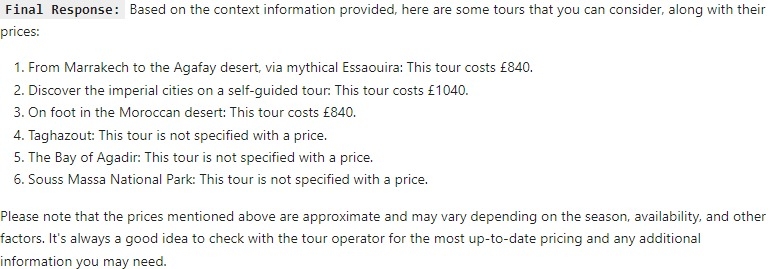
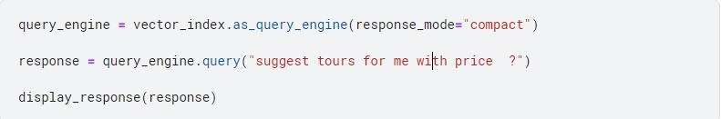

### Night walker
Members: Charaf hamidi, Ibtissam Essadik \
GitHub Repo: [Night walker Repo](https://github.com/charaf19/9erini) \
Idea: Providing a comprehensive safety solution for night workers through GPS tracking, emergency alerts, and real-time support.

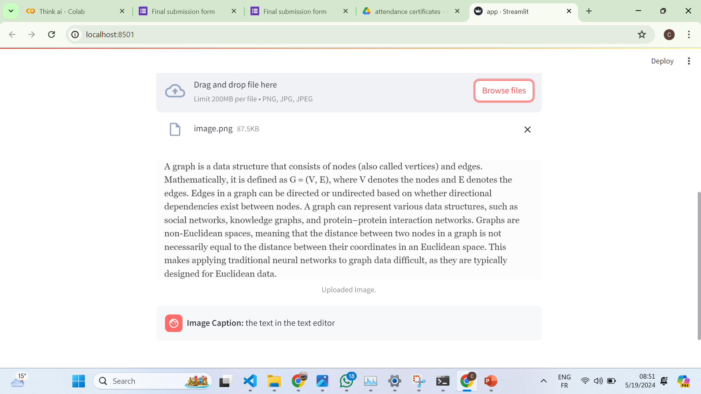

### DataSci
Members: Amine Ahlyel, Zakariae Mrabet, Othmane Nouakchi \
GitHub Repo: [DataSci Repo](https://github.com/1337DataSci/Matssyedch) \
Idea: Developing a platform to enhance public health data analysis and visualization, supporting healthcare providers in tracking and responding to health trends.

### homeless autoencoders
Members: Mouad Ennasiry, Salim El Mardi, Reda Elkate \
GitHub Repo : [homeless autoencoders Repo](https://github.com/mouadenna/MO3ALIMI)
Idea: MO3ALIMI is a platform designed to help illiterate adults learn the basics of literacy. The platform focuses on alphabets, writing, reading, and basic numeracy. Users receive personalized quizzes that assist them in learning and practicing simultaneously.
